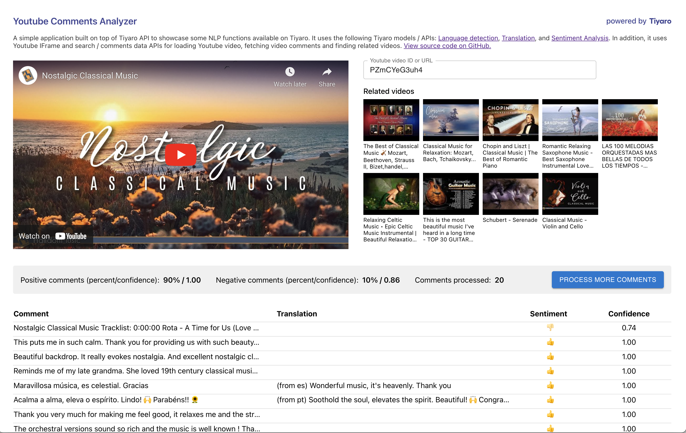

# Welcome to Youtube Comments Analyzer

A simple application built on top of Tiyaro API to showcase some NLP functions available on Tiyaro.

It uses the following Tiyaro models / APIs:
[Language detection](https://console.tiyaro.ai/explore/azure-1-cog-text-language-detect/api),
[Translation](https://console.tiyaro.ai/search/translation) and
[Sentiment Analysis](https://console.tiyaro.ai/search/sentiment%20analysis).
In addition, it uses Youtube IFrame and search / comments data APIs for loading Youtube video,
fetching video comments and finding related videos.

## Blog

A blog that provides step-by-step guide to developing this app can be found [here](https://medium.com/@klatchco/youtube-comments-analyzer-in-7-easy-steps-7475dea85a9d). Another blog on the broader topic of "The rise of AI apps" can be found [here](https://medium.com/@klatchco/the-rise-of-modern-ai-apps-72e512e16c56).

## Screenshot / [live demo](https://youtube-comments-analyzer.forallai.com/)



## Backend

Nodejs based Apollo GraphQL server to provide two APIs:
- get related Youtube videos
- analyze comments for a Youtube video

Build the code with:

```console
$ cd backend
$ yarn
$ yarn build
```

Edit `env.sh` and enter your Youtube and Tiyaro API key.
You can get Youtube API key [here](https://developers.google.com/youtube/v3/getting-started) and Tiyaro API key [here](https://console.tiyaro.ai).

Run in development mode:

```console
$ yarn start
```

Run in production mode:

```console
$ yarn start-prod
```

## Frontend

React + MUI based UI to show Youtube video, related videos, video comments analysis.

Build the code with:

```console
$ cd frontend
$ npm install
$ npm run build
```

Start UI with:

```console
$ npm start
```

## License

[Apache License 2.0](LICENSE)
